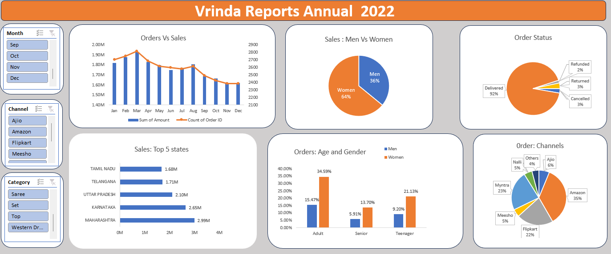

# Vrinda Store Annual Sales Analysis (2022) 📊

## 🎯 Project Objective
The goal of this project is to analyze the annual retail sales data of Vrinda Store for the year 2022. By evaluating customer purchasing behavior, regional performance, and sales channels, this interactive dashboard provides actionable business insights to help optimize future sales strategies.

## 🛠️ Tech Stack Used
* **Microsoft Excel:** Data Cleaning, Data Processing, Pivot Tables, and Interactive Dashboards.

## 🧹 Data Cleaning & Processing
* **Data Standardization:** Corrected inconsistent categorical data (e.g., standardized gender values like 'M' to 'Men' and 'W' to 'Women' using Find & Replace).
* **Date Extraction:** Extracted the 'Month' from the date column using the TEXT function for monthly trend analysis.
* **Demographic Segmentation:** Created a new 'Age Group' column to categorize customers (Teenager, Adult, Senior) using Nested IF formulas.

## 📈 Key Insights
* **Demographics:** Women account for **~64%** of the total sales, making them the primary customer base.
* **Age Group:** The **Adult** category (30-49 years) drives the maximum number of orders.
* **Top Regions:** **Maharashtra, Karnataka, and Uttar Pradesh** are the top three performing states, generating the highest revenue.
* **Sales Channels:** **Amazon, Flipkart, and Myntra** collectively contribute to roughly **80%** of the total sales.
* **Seasonal Trend:** The highest sales and order volume occurred in the month of **March**.

## 💡 Final Recommendations
Based on the data analysis, Vrinda Store should focus its marketing budget and strategy on:
1.  **Targeted Marketing:** Target **Women** in the **30-49 years (Adult)** demographic, as they are the highest-converting segment.
2.  **Geographic Focus:** Run localized ad campaigns and offer special discount coupons in **Maharashtra, Karnataka, and UP**.
3.  **Channel Optimization:** Maximize ad spend, inventory placement, and visibility on the top-performing e-commerce platforms: **Amazon, Flipkart, and Myntra**.

## 📸 Dashboard Preview

*(Note: Download the interactive Excel file `Vrinda_Store_Annual_Sales_Dashboard.xlsx` to fully use the interactive slicers and dynamic filters).*
